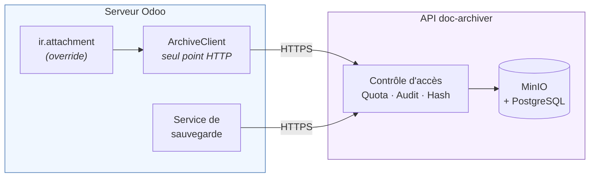

# Distributed Archive Storage pour Odoo

Module Odoo qui redirige le stockage des pièces jointes vers un système
d'archivage distribué externe, au lieu du filestore local du serveur.

> **En une phrase** : quand un utilisateur joint un fichier à une facture, un
> contact ou n'importe quel document Odoo, ce fichier n'est plus écrit sur le
> disque du serveur Odoo — il part vers une API d'archivage qui le stocke dans
> MinIO, le réplique entre sites, et en garde la trace.

---

## Le problème résolu

Par défaut, Odoo stocke les pièces jointes dans un dossier local (`filestore`).
Cela pose trois limites en production :

| Limite | Conséquence |
|---|---|
| Stockage lié au serveur | La volumétrie est bornée par le disque de la machine Odoo |
| Pas de réplication | Une panne disque fait perdre les documents |
| Pas de traçabilité | Aucun journal de qui a déposé, consulté ou supprimé quoi |

Ce module délègue ces trois responsabilités à un service d'archivage dédié
([doc-archiver](#lécosystème)), conçu pour ça : stockage objet distribué,
réplication inter-sites, quotas, audit.

---

## Architecture



Le principe directeur : **le module est un pont HTTP pur**. Il ne contient
aucune logique métier — pas de contrôle d'accès aux documents, pas de calcul
de quota, pas de politique de rétention. Tout cela vit côté API, qui reste la
seule source de vérité. Le module traduit les opérations Odoo en appels HTTP,
rien de plus.

Cette contrainte a été tenue tout au long du développement : elle garantit
qu'une règle métier n'existe qu'à un seul endroit, et ne peut donc pas diverger
entre les deux systèmes.

### L'écosystème

Ce dépôt est le **client Odoo**. Il consomme une API d'archivage développée
séparément (FastAPI + MinIO + PostgreSQL, déploiement Kubernetes multi-sites).
Les deux projets ne partagent **aucun code** — uniquement un contrat HTTP.

---

## Ce que contient ce dépôt

| Composant | Rôle |
|---|---|
| `addons/distributed_archive_storage/` | Module Odoo — redirige `ir.attachment` vers l'API |
| `config/`, `docker-compose.yml` | Environnement de développement complet (Odoo + PostgreSQL) |

---

## Décisions de conception

Cette section documente les choix non évidents et leur justification — c'est
souvent là que se trouve l'essentiel du travail.

### 1. L'archivage est un choix par utilisateur, pas un réglage global

Chaque utilisateur décide dans son profil s'il veut le stockage local ou
l'archivage distribué. Les fichiers déjà stockés ne sont **jamais** déplacés
rétroactivement, et le champ `storage_provider` est figé à la création de
chaque pièce jointe.

*Pourquoi* : permet une migration progressive et réversible. Un basculement
global aurait rendu inaccessibles tous les fichiers existants si l'API devenait
indisponible.

### 2. Traitement uniforme de toutes les pièces jointes

Aucune classification par type de document. Une facture fournisseur, un bon de
commande et une pièce jointe sur un contact suivent exactement le même chemin.

Les seules exclusions sont **techniques**, jamais métier :

| Exclusion | Raison |
|---|---|
| `res_field` renseigné | Champ binaire interne (image de produit, logo), pas une pièce jointe utilisateur |
| Aucun nom de fichier | Écriture technique interne (pré-calcul de miniature) |
| `type = "url"` | Pièce jointe qui n'est qu'un lien, sans contenu binaire |

### 3. Blocage si l'API est injoignable, pas de repli silencieux

Si l'archivage échoue, l'action utilisateur est **bloquée** avec un message
explicite.

*Pourquoi* : un repli vers le stockage local créerait un fichier que
l'utilisateur croit archivé alors qu'il n'a jamais été vu par l'API — ni
audité, ni compté dans le quota, ni répliqué. Une divergence silencieuse est
pire qu'une erreur visible.

**Exception assumée** : la lecture en contexte non interactif (envoi d'e-mails
en masse, rendu PDF groupé) renvoie un contenu vide et journalise l'erreur,
plutôt que de faire échouer tout un traitement par lot.

### 4. Un seul point de sortie HTTP

Aucun modèle Odoo n'appelle `requests` directement. Tout passe par
`ArchiveClient`, qui ne connaît rien d'Odoo : il reçoit une configuration
simple et renvoie des données Python.

*Pourquoi* : centralise les timeouts, les tentatives et la traduction des
erreurs. Toute évolution du contrat API se corrige à un seul endroit.

### 5. Retry uniquement sur les erreurs réseau transitoires

Une nouvelle tentative est faite sur timeout ou connexion refusée, avec un
court délai. **Jamais** sur une réponse 4xx : réessayer un 401 ou un 404 ne
peut pas réussir, cela ne ferait qu'ajouter de la latence à un échec certain.

### 6. Aucune trace technique n'atteint l'utilisateur

Les erreurs API sont traduites en exceptions typées, puis en messages lisibles
par un non-technicien. Les tracebacks et détails `urllib3` vont uniquement dans
les logs serveur.

| HTTP | Exception | Message utilisateur |
|---|---|---|
| 401 / 403 | `ArchiveAuthError` | Jeton invalide ou accès refusé |
| 404 | `ArchiveNotFoundError` | Document introuvable |
| 410 | `ArchiveGoneError` | Document supprimé côté archive |
| 422 | `ArchiveValidationError` | Fichier vide ou requête invalide |
| 503 | `ArchiveUnavailableError` | Site temporairement indisponible |
| 5xx | `ArchiveServerError` | Erreur interne de l'API |
| réseau | `ArchiveConnectionError` | Serveur injoignable |

Le client filtre même un éventuel traceback Python qui aurait fuité dans une
réponse 500 : l'utilisateur ne doit jamais en voir un.

### 7. La sauvegarde de la base est pilotée hors d'Odoo

Elle est déclenchée par doc-archiver, pas par ce module.

*Pourquoi* : un système de sauvegarde ne doit pas dépendre de ce qu'il
sauvegarde. Des réglages vivant dans Odoo seraient illisibles précisément quand
Odoo est en panne — c'est-à-dire quand la sauvegarde compte le plus.

Corollaire : le mot de passe maître ne vit plus en clair sur l'hôte Odoo, il est
stocké chiffré côté doc-archiver et déchiffré en mémoire le temps de l'appel.

---

## Installation

### Prérequis

- **Docker** et **Docker Compose**
- Une instance **doc-archiver** joignable, avec un **projet** créé (et son
  token) et le **site** cible actif

> Un seul projet suffit désormais : les sauvegardes de la base Odoo sont
> rangées dans un sous-dossier dédié (`_backups/odoo/`) du même bucket, avec
> leur propre rétention — elles ne peuvent plus se mélanger aux pièces jointes.

### Démarrage

```bash
# 1. Fichiers de configuration (aucun n'est versionné : ils contiennent des secrets)
cp .env.example .env
cp config/odoo.conf.example config/odoo.conf
chmod 600 .env config/odoo.conf

# 2. Renseigner les valeurs (voir tableau ci-dessous), puis démarrer
docker compose up -d
```

| Fichier | À renseigner |
|---|---|
| `.env` | `POSTGRES_DB`, `POSTGRES_USER`, `POSTGRES_PASSWORD` |
| `config/odoo.conf` | `admin_passwd`, `db_password` |

Odoo écoute sur **http://localhost:9030**.

### Installer le module

Interface Odoo → **Applications** → *Mettre à jour la liste des applications*
→ rechercher **Distributed Archive Storage** → **Installer**.

En ligne de commande :

```bash
docker exec <conteneur_web> odoo -d <base> -i distributed_archive_storage --stop-after-init
docker restart <conteneur_web>
```

> **Après toute modification du code** (Python ou XML), modifier les fichiers
> ne suffit pas — Odoo charge le code au démarrage :
> ```bash
> docker exec <conteneur_web> odoo -u distributed_archive_storage -d <base> --stop-after-init
> docker restart <conteneur_web>
> ```

---

## Configuration

### Déclarer un serveur d'archivage

**Réglages → Archivage Distribué → Serveurs** → *Nouveau*

| Champ | Description |
|---|---|
| **Server Name** | Libellé libre (ex. « Archive Casa — Production ») |
| **API URL** | URL de l'API. Depuis un conteneur vers l'hôte : `http://host.docker.internal:30800` |
| **Site** | Site cible, doit exister sur le déploiement (visible via `GET /health`) |
| **API Token** | Token du projet — visible dans la console doc-archiver |
| **Timeout (s)** | Délai maximal par requête HTTP (défaut : 30) |
| **Verify SSL** | À désactiver uniquement en dev avec un certificat auto-signé |

Le bouton **Tester la connexion** vérifie que le site existe et résout
automatiquement le projet associé au token.

> La politique de suppression (soft / hard) ne se configure **pas** ici : elle
> est portée par le projet côté API, et Odoo la suit automatiquement. Un seul
> endroit de vérité, pas deux réglages qui peuvent diverger.

### Restreindre l'accès

- **Authorized Users** — si vide, tous les utilisateurs internes peuvent
  choisir ce serveur. Sinon, seuls ceux listés.
- **Require User Credentials** — impose de ressaisir un *Verification Secret*
  dans le profil utilisateur. Ce secret est **distinct de l'API Token** : il
  prouve l'autorisation sans jamais exposer le vrai jeton.

### Activer pour un utilisateur

**Mon Profil** → *Storage Provider* = **Distributed Archive Storage**, puis
choisir un **Archive Server**.

---

## Fonctionnement interne

```
addons/distributed_archive_storage/
├── models/
│   ├── ir_attachment.py           # override du stockage (create/write/read/delete)
│   ├── archive_storage_server.py  # configuration d'un serveur + test de connexion
│   ├── res_users.py               # préférence de stockage par utilisateur
│   └── res_config_settings.py     # bloc d'aperçu dans les Réglages généraux
├── services/
│   ├── archive_client.py          # SEUL point qui fait du HTTP
│   └── exceptions.py              # exceptions typées par code de retour
├── security/                      # groupes + règles d'accès
├── views/
└── migrations/                    # scripts de migration de schéma
```

### Cycle de vie d'un fichier archivé

1. `create()` / `write()` interceptent `raw` ou `datas` dans les valeurs
2. Filtrage des écritures techniques (voir [décision n°2](#2-traitement-uniforme-de-toutes-les-pièces-jointes))
3. Si l'utilisateur a choisi l'archivage : `POST /documents`
4. Le contenu binaire est **retiré** des valeurs ; `store_fname` devient un
   marqueur `archive:<server_id>:<document_id>`
5. Les métadonnées renvoyées par l'API sont enregistrées

À la lecture, `_file_read()` reconnaît le préfixe `archive:` et récupère le
contenu via l'API au lieu du disque.

### Champs ajoutés à `ir.attachment`

| Champ | Contenu |
|---|---|
| `storage_provider` | `local` ou `archive` — figé à la création |
| `archive_document_id` | Identifiant du document côté API |
| `archive_server_id` | Serveur utilisé (`ondelete="restrict"`) |
| `archive_path` | Chemin MinIO (informatif) |
| `archive_checksum` | SHA-256 calculé par l'API (distinct du SHA-1 natif d'Odoo) |
| `archive_state` | `ARCHIVED`, `DELETED`, `HARD_DELETED` |

---

## Sauvegarde de la base Odoo

Assurée par **doc-archiver**, plus par ce dépôt. Le service `odoo-backup` qui
vivait ici a été retiré : il faisait exactement le même travail, mais avec le
mot de passe maître en clair dans `backup/backup-config.env`.

Configuration : console doc-archiver -> **Projets** -> *Modifier* -> section
**Instance Odoo**.

| Champ | Valeur |
|---|---|
| Hébergement | `Serveur` |
| URL Odoo | racine de l'instance, **sans** suffixe `/odoo` (le gestionnaire de base est à la racine) |
| Nom de la base | ex. `ma_base` |
| Mot de passe maître | = `admin_passwd` de `config/odoo.conf` — stocké **chiffré** |
| Intervalle / rétention | vides = réglage global |

Le bouton **Tester la connexion** valide URL + base + mot de passe contre
l'instance réelle avant d'enregistrer.

> **URL depuis un conteneur** : `localhost` désigne le conteneur qui appelle,
> pas l'hôte. Si doc-archiver tourne dans Kubernetes/minikube et Odoo sur
> l'hôte, utiliser `http://host.minikube.internal:9030`.

Les sauvegardes atterrissent sous `_backups/odoo/` dans le bucket du projet,
marquées `is_backup=true` — donc invisibles dans l'explorateur de documents, et
avec une rétention **indépendante** de celle des sauvegardes de projet.

### Cas Odoo.sh

Odoo.sh bloque l'accès externe au gestionnaire de base : doc-archiver ne peut
pas aller chercher le dump. C'est alors à Odoo de **pousser** son backup vers
`POST /documents` avec le token du projet, en passant
`is_backup=true&folder_prefix=_backups/odoo` — sans ces deux paramètres, le zip
serait traité comme une pièce jointe ordinaire.

L'ancien `backup/backup-script.sh` reste une bonne base pour écrire cette tâche
planifiée : `git show ed1e18e` le restitue.

### Restaurer une base

1. Récupérer le zip depuis la console doc-archiver
2. Ouvrir `http://localhost:9030/web/database/manager`
3. **Restore Database** → sélectionner le zip → saisir le mot de passe maître

> Le mot de passe maître ne chiffre rien : il ne fait que garder la porte. Un
> zip produit avec un ancien mot de passe reste restaurable après changement.

---

## Sécurité

### Fichiers jamais versionnés

| Fichier | Contient |
|---|---|
| `.env` | Mots de passe PostgreSQL |
| `config/odoo.conf` | `admin_passwd`, mot de passe de la base |

Seuls les `*.example` sont versionnés. Vérification :

```bash
git check-ignore -v .env config/odoo.conf
git log --all --full-history -- .env config/odoo.conf
```

### Le mot de passe maître Odoo

`admin_passwd` autorise **backup, restore, duplicate, create et DROP** de
n'importe quelle base de l'instance. Ce n'est pas le mot de passe du compte
`admin` — c'est un secret bien plus puissant, unique pour toute l'instance.

Pour le changer sans coupure :

1. `config/odoo.conf`, puis redémarrage d'Odoo
2. Le mettre à jour dans doc-archiver (console -> Projets -> Instance Odoo)
3. Cliquer **Tester la connexion** pour confirmer avant le cycle suivant

Une divergence fait échouer les sauvegardes de façon **silencieuse** : Odoo
répond `200` avec une page HTML d'erreur, jamais un code d'erreur. doc-archiver
vérifie la signature du zip reçu et refuse une réponse qui n'en est pas un,
mais rien n'alerte
en dehors des logs.

### Isolation des données

Une règle d'enregistrement restreint les pièces jointes archivées à leur
créateur pour les utilisateurs standard ; les membres du groupe *Archive
Storage Manager* voient tout. Cette règle ne touche jamais aux pièces jointes
locales classiques.

Côté API, un token de projet ne donne accès qu'aux documents de ce projet.

---

## Limites connues et pistes d'évolution

Documenté volontairement — ces points sont des choix assumés, pas des oublis.

| Limite | Détail |
|---|---|
| **Attribution non authentifiée** | Odoo transmet l'utilisateur courant à l'API pour la traçabilité, mais ce champ est déclaré par le client : il est informatif et n'intervient jamais dans une décision d'autorisation. Une attribution non-répudiable exigerait de vrais comptes utilisateurs côté API. |
| **Pas d'alerte sur échec de sauvegarde** | Les échecs sont journalisés avec une cause probable explicite, mais aucune notification externe n'est émise. |
| **Restauration manuelle** | La restauration passe par le gestionnaire de bases d'Odoo ; aucun script automatisé. |
| **Réplication inter-sites à activer** | Le mécanisme existe côté API mais dépend d'un site de secours réellement joignable. |

---

## Dépannage

| Symptôme | Cause probable | Solution |
|---|---|---|
| « le site configuré n'existe pas » | Site inactif sur ce déploiement | Comparer avec `GET /health` |
| « Authentification refusée » | Token invalide, expiré, ou projet supprimé | Vérifier le token dans la console |
| « Impossible de se connecter » | URL erronée ou API arrêtée | Depuis un conteneur, utiliser `host.docker.internal`, pas `localhost` |
| Modification de code sans effet | Module non rechargé | `odoo -u distributed_archive_storage` puis redémarrage |
| Pièce jointe restée en local | Utilisateur non configuré | Vérifier *Storage Provider* dans son profil |
| Aucune sauvegarde de base produite | Mot de passe maître, URL ou nom de base erronés | Console doc-archiver -> Instance Odoo -> **Tester la connexion** |
| Sauvegarde de base « incomplète » | Hébergement « Serveur » sans URL/base/mot de passe | Bandeau ambre sur la page Projets de la console |

```bash
docker compose logs -f web | grep -i archive     # module Odoo
# Sauvegarde de la base : journal d'audit de la console doc-archiver
# (action « odoo_backup_pull »), ou logs du pod api : grep ODOO-BACKUP
```

---

## Licence

LGPL-3
